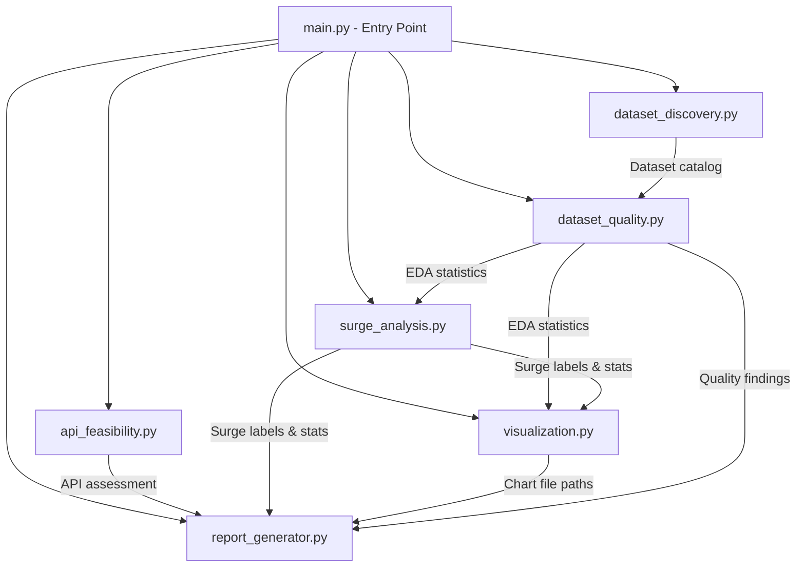
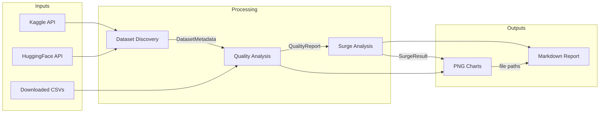

# Design Document: EDA Financial Discussions

## Overview

This design describes a Python-based Exploratory Data Analysis (EDA) pipeline for evaluating datasets suitable for predicting engagement and sentiment surges in stock-related social media discussions. The system discovers public datasets (Kaggle, HuggingFace), assesses API collection feasibility (X/Twitter, Reddit), performs comprehensive quality analysis, operationalizes a surge definition, generates visualizations, and produces a markdown summary report with a final recommendation.

The pipeline is structured as a set of Python scripts orchestrated by a single entry point, producing PNG charts and a markdown report as outputs. An exploration notebook (`notebooks/exploration.ipynb`) is provided for interactive analysis, importing reusable functions from `src/` modules.

## Architecture

The system follows a sequential pipeline architecture where each stage produces intermediate results consumed by downstream stages. The entry point script orchestrates execution order and handles error recovery.



### Pipeline Stages

1. **Dataset Discovery** — Scans Kaggle and HuggingFace for candidate datasets, records metadata
2. **API Feasibility** — Evaluates X/Twitter and Reddit API capabilities, costs, and limitations
3. **Dataset Quality Analysis** — Loads candidate datasets and performs comprehensive EDA
4. **Surge Analysis** — Operationalizes surge definition, computes labels, evaluates class balance
5. **Visualization** — Generates all charts as PNG files
6. **Report Generation** — Assembles markdown report with findings and recommendation

### Exploration Notebook

An interactive Jupyter notebook (`notebooks/exploration.ipynb`) is provided alongside the pipeline scripts. It imports functions from `src/` modules and allows data scientists to:
- Interactively explore candidate datasets
- Visualize distributions and patterns
- Experiment with surge threshold parameters
- Document findings with inline visualizations

The notebook is supplementary — the pipeline scripts remain the authoritative, reproducible execution path.

### Design Decisions

- **Sequential pipeline over DAG**: The analysis stages have clear dependencies and modest data sizes, so a simple sequential orchestration is sufficient. No need for a workflow engine.
- **Intermediate results as DataFrames/dicts**: Stages pass results as pandas DataFrames and Python dictionaries. No intermediate file serialization between stages (except final outputs).
- **Graceful degradation**: If a stage fails (e.g., dataset download unavailable), the pipeline logs the error and continues with remaining stages, producing a partial report.

## Components and Interfaces

### 1. Entry Point (`main.py`)

Orchestrates the full pipeline, handles CLI arguments, and manages error recovery.

```python
def run_pipeline(config: PipelineConfig) -> PipelineResult:
    """Execute all analysis stages in sequence."""
    ...
```

### 2. Dataset Discovery (`src/dataset_discovery.py`)

```python
@dataclass
class DatasetMetadata:
    name: str
    source_platform: str  # "kaggle" | "huggingface"
    record_count: int
    date_range: tuple[str, str]  # (start, end) ISO dates
    columns: list[str]
    freshness_days: int
    has_engagement_metrics: bool
    has_sentiment_fields: bool
    is_complete: bool  # True if has both engagement + sentiment

def scan_kaggle(search_terms: list[str]) -> list[DatasetMetadata]:
    """Search Kaggle for stock discussion datasets."""
    ...

def scan_huggingface(search_terms: list[str]) -> list[DatasetMetadata]:
    """Search HuggingFace for stock discussion datasets."""
    ...

def flag_incomplete_datasets(datasets: list[DatasetMetadata]) -> list[DatasetMetadata]:
    """Flag datasets missing engagement or sentiment fields."""
    ...
```

### 3. API Feasibility Assessor (`src/api_feasibility.py`)

```python
@dataclass
class APIAssessment:
    platform: str  # "twitter" | "reddit"
    rate_limits: dict[str, Any]
    endpoints: list[str]
    cost_tiers: list[dict[str, Any]]
    available_fields: list[str]
    historical_access: bool
    estimated_collection_time_hours: float
    estimated_cost_usd: float
    supports_surge_label: bool
    paid_fields: list[dict[str, str]]  # fields behind paywall

def assess_twitter_api() -> APIAssessment:
    """Evaluate X/Twitter API feasibility."""
    ...

def assess_reddit_api() -> APIAssessment:
    """Evaluate Reddit API feasibility."""
    ...
```

### 4. Dataset Quality Analyzer (`src/dataset_quality.py`)

```python
@dataclass
class QualityReport:
    schema: dict[str, str]  # column -> dtype
    record_count: int
    ticker_count: int
    missing_values: dict[str, float]  # column -> % missing
    high_risk_columns: list[str]  # >30% missing
    date_range: tuple[str, str]
    temporal_gaps: list[tuple[str, str]]  # gaps > 7 days
    posting_frequency: dict[str, float]  # period -> posts/day
    engagement_stats: dict[str, dict[str, float]]  # metric -> {mean, median, p90, p95, p99}
    sentiment_stats: dict[str, float]  # polarity stats
    bullish_bearish_ratio: float
    risks: list[str]

def analyze_structure(df: pd.DataFrame) -> dict:
    """Document schema, types, record count, ticker count."""
    ...

def compute_missing_values(df: pd.DataFrame) -> dict[str, float]:
    """Compute per-column missing percentages, flag >30%."""
    ...

def analyze_time_coverage(df: pd.DataFrame, date_col: str) -> dict:
    """Analyze date range, gaps >7 days, posting frequency."""
    ...

def compute_engagement_distributions(df: pd.DataFrame, metric_cols: list[str]) -> dict:
    """Compute summary statistics for engagement metrics."""
    ...

def analyze_sentiment(df: pd.DataFrame, text_col: str) -> dict:
    """Perform sentiment analysis, compute distributions."""
    ...

def assess_sentiment_reliability(df: pd.DataFrame, text_col: str) -> dict:
    """Compare two sentiment methods for inter-method agreement."""
    ...

def compare_stock_vs_general(stock_df: pd.DataFrame, general_df: pd.DataFrame) -> dict:
    """Compare engagement patterns between stock and general discussions."""
    ...
```

### 5. Surge Analyzer (`src/surge_analysis.py`)

```python
@dataclass
class SurgeConfig:
    engagement_percentile: float  # e.g., 0.95
    sentiment_std_devs: float  # e.g., 1.0
    time_window_hours: int  # e.g., 24

@dataclass
class SurgeResult:
    config: SurgeConfig
    surge_count: int
    total_posts: int
    surge_percentage: float
    class_imbalance_ratio: float
    is_viable: bool  # True if positive class >= 2%

def normalize_engagement(df: pd.DataFrame, metric_cols: list[str], ticker_col: str) -> pd.DataFrame:
    """Normalize engagement metrics relative to ticker historical baseline."""
    ...

def compute_surge_labels(
    df: pd.DataFrame,
    config: SurgeConfig,
    engagement_cols: list[str],
    sentiment_col: str,
    timestamp_col: str,
    ticker_col: str
) -> pd.Series:
    """Compute binary surge labels for each post."""
    ...

def evaluate_surge_definitions(
    df: pd.DataFrame,
    percentiles: list[float],
    std_devs: list[float],
    engagement_cols: list[str],
    sentiment_col: str,
    timestamp_col: str,
    ticker_col: str
) -> list[SurgeResult]:
    """Evaluate multiple surge definitions and report class balance."""
    ...

def check_timestamp_resolution(df: pd.DataFrame, timestamp_col: str) -> dict:
    """Check if timestamps support 24-hour window measurement."""
    ...
```

### 6. Visualization Engine (`src/visualization.py`)

```python
def generate_engagement_distributions(stats: dict, output_dir: str) -> list[str]:
    """Generate engagement metric distribution charts. Returns file paths."""
    ...

def generate_sentiment_distributions(stats: dict, output_dir: str) -> list[str]:
    """Generate sentiment polarity histogram. Returns file paths."""
    ...

def generate_surge_frequency(surge_data: pd.DataFrame, output_dir: str) -> str:
    """Generate surge event frequency over time chart. Returns file path."""
    ...

def generate_dataset_comparison(datasets: list[DatasetMetadata], output_dir: str) -> str:
    """Generate comparison chart of dataset characteristics. Returns file path."""
    ...
```

### 7. Report Generator (`src/report_generator.py`)

```python
def generate_report(
    discovery_results: list[DatasetMetadata],
    api_assessments: list[APIAssessment],
    quality_reports: list[QualityReport],
    surge_results: list[SurgeResult],
    chart_paths: list[str],
    output_path: str
) -> str:
    """Generate comprehensive markdown report. Returns file path."""
    ...

def make_recommendation(
    quality_reports: list[QualityReport],
    api_assessments: list[APIAssessment],
    surge_results: list[SurgeResult]
) -> dict:
    """Determine best data path with justification."""
    ...
```

## Data Models

### Core Data Structures

```python
from dataclasses import dataclass, field
from typing import Any, Optional

@dataclass
class PipelineConfig:
    """Configuration for the full EDA pipeline."""
    output_dir: str = "output"
    chart_format: str = "png"
    kaggle_search_terms: list[str] = field(default_factory=lambda: [
        "stock twitter sentiment",
        "stock reddit discussion",
        "financial social media engagement",
    ])
    huggingface_search_terms: list[str] = field(default_factory=lambda: [
        "stock sentiment",
        "financial tweets",
        "reddit wallstreetbets",
    ])
    surge_percentiles: list[float] = field(default_factory=lambda: [0.90, 0.95, 0.99])
    surge_std_devs: list[float] = field(default_factory=lambda: [0.5, 1.0, 1.5])
    surge_window_hours: int = 24
    min_positive_class_pct: float = 0.02  # 2% threshold

@dataclass
class PipelineResult:
    """Aggregated results from the full pipeline."""
    datasets_discovered: list[DatasetMetadata]
    api_assessments: list[APIAssessment]
    quality_reports: list[QualityReport]
    surge_results: list[SurgeResult]
    chart_paths: list[str]
    report_path: str
    errors: list[str]  # Non-fatal errors encountered

@dataclass
class DatasetMetadata:
    """Metadata for a discovered dataset."""
    name: str
    source_platform: str
    record_count: int
    date_range: tuple[str, str]
    columns: list[str]
    freshness_days: int
    has_engagement_metrics: bool
    has_sentiment_fields: bool
    is_complete: bool

@dataclass
class APIAssessment:
    """Feasibility assessment for a data collection API."""
    platform: str
    rate_limits: dict[str, Any]
    endpoints: list[str]
    cost_tiers: list[dict[str, Any]]
    available_fields: list[str]
    historical_access: bool
    estimated_collection_time_hours: float
    estimated_cost_usd: float
    supports_surge_label: bool
    paid_fields: list[dict[str, str]]

@dataclass
class QualityReport:
    """EDA quality analysis results for a dataset."""
    dataset_name: str
    schema: dict[str, str]
    record_count: int
    ticker_count: int
    missing_values: dict[str, float]
    high_risk_columns: list[str]
    date_range: tuple[str, str]
    temporal_gaps: list[tuple[str, str]]
    posting_frequency: dict[str, float]
    engagement_stats: dict[str, dict[str, float]]
    sentiment_stats: dict[str, float]
    bullish_bearish_ratio: float
    sentiment_reliability: Optional[dict[str, float]]
    risks: list[str]
    eda_questions_answered: dict[str, bool]
    failing_objectives: list[str]
    recommendation: str  # "suitable" | "unsuitable"

@dataclass
class SurgeConfig:
    """Configuration for a surge definition."""
    engagement_percentile: float
    sentiment_std_devs: float
    time_window_hours: int

@dataclass
class SurgeResult:
    """Results from applying a surge definition."""
    config: SurgeConfig
    surge_count: int
    total_posts: int
    surge_percentage: float
    class_imbalance_ratio: float
    is_viable: bool
    timestamp_sufficient: bool
```

### Data Flow



## Correctness Properties

*A property is a characteristic or behavior that should hold true across all valid executions of a system — essentially, a formal statement about what the system should do. Properties serve as the bridge between human-readable specifications and machine-verifiable correctness guarantees.*

### Property 1: Dataset completeness flagging

*For any* dataset with a set of column names, the dataset SHALL be flagged as incomplete (`is_complete = False`) if and only if it lacks engagement metric columns OR sentiment-related columns.

**Validates: Requirements 1.4**

### Property 2: Metadata extraction completeness

*For any* API response representing a discovered dataset, the metadata extraction function SHALL produce a `DatasetMetadata` object with all required fields (name, source_platform, record_count, date_range, columns, freshness_days) populated and non-null.

**Validates: Requirements 1.3**

### Property 3: API collection cost and time estimation

*For any* valid rate limit (requests/minute > 0) and cost per request (>= 0), the estimated collection time for N posts SHALL equal N divided by the effective request rate, and the estimated cost SHALL equal N multiplied by the cost per request.

**Validates: Requirements 2.3**

### Property 4: Surge label feasibility assessment

*For any* set of available API fields, the surge label feasibility SHALL be True if and only if the field set contains at least one engagement metric, at least one sentiment-capable text field, and a timestamp field with sufficient resolution.

**Validates: Requirements 2.5**

### Property 5: Missing value computation and high-risk flagging

*For any* DataFrame, the computed missing value percentage for each column SHALL equal the actual count of null/NaN values divided by total rows, and a column SHALL be flagged as high-risk if and only if its missing percentage exceeds 30%.

**Validates: Requirements 3.2**

### Property 6: Temporal gap detection

*For any* sorted sequence of timestamps, the time coverage analysis SHALL identify all consecutive pairs where the gap exceeds 7 days, and the reported date range SHALL span from the minimum to maximum timestamp in the sequence.

**Validates: Requirements 3.3**

### Property 7: Engagement statistics correctness

*For any* non-empty numeric array, the computed summary statistics (mean, median, 90th/95th/99th percentiles) SHALL match the mathematically correct values for that array.

**Validates: Requirements 3.4**

### Property 8: Surge label correctness

*For any* post with known normalized engagement rank and sentiment shift magnitude, the surge label SHALL be True if and only if the normalized engagement exceeds the configured percentile threshold AND the sentiment shift exceeds the configured standard deviation threshold within the time window.

**Validates: Requirements 3.6, 4.1**

### Property 9: Per-ticker engagement normalization

*For any* DataFrame containing posts from multiple stock tickers, the normalization function SHALL compute engagement statistics independently per ticker, such that each ticker's normalized engagement values are relative only to that ticker's historical distribution.

**Validates: Requirements 4.2**

### Property 10: Class balance computation and viability flagging

*For any* set of surge labels (boolean array), the surge percentage SHALL equal the count of True values divided by total count multiplied by 100, and the definition SHALL be flagged as non-viable if and only if the surge percentage is below 2%.

**Validates: Requirements 3.7, 4.3**

### Property 11: Dataset suitability decision

*For any* set of EDA objective results (pass/fail for each objective), the dataset SHALL be recommended as unsuitable if and only if three or more objectives have failed.

**Validates: Requirements 3.11, 3.12**

### Property 12: Report section completeness

*For any* set of pipeline results (discovery, API assessment, quality, surge, charts), the generated markdown report SHALL contain all required sections (executive summary, dataset discovery, API feasibility, EDA statistics, surge analysis, recommendation) and SHALL include relative path references to every chart file provided.

**Validates: Requirements 6.1, 6.2**

## Error Handling

### Strategy

The pipeline uses a **fail-soft** approach: individual stage failures are caught, logged, and the pipeline continues with remaining stages. The final report documents which stages succeeded and which failed.

### Error Categories

| Category | Handling | Example |
|----------|----------|---------|
| Network errors | Log warning, skip dataset/API, continue | Kaggle API timeout |
| Missing data | Log, mark as limitation in report | Dataset lacks sentiment column |
| Computation errors | Log, skip metric, continue | Division by zero in normalization |
| File I/O errors | Log, attempt alternative path, fail stage if unrecoverable | Cannot write PNG to output dir |
| Dependency errors | Log descriptive message, skip dependent analysis | Missing NLP library |

### Error Propagation

```python
class PipelineError:
    stage: str
    severity: str  # "warning" | "error" | "fatal"
    message: str
    recoverable: bool

# Each stage returns (result, errors) tuple
# Pipeline aggregates errors and includes them in final report
```

### Graceful Degradation Rules

1. If dataset discovery fails for one platform, continue with the other
2. If a candidate dataset cannot be downloaded, skip it and note in report
3. If sentiment analysis fails (missing NLP model), skip sentiment-dependent analyses but continue with engagement-only analysis
4. If chart generation fails, continue with report generation (omit chart references)
5. If all stages fail, produce a minimal report documenting all failures

## Testing Strategy

### Property-Based Testing

The project uses **Hypothesis** (Python PBT library) for property-based testing of core computation logic.

**Configuration:**
- Minimum 100 iterations per property test
- Each test tagged with: `Feature: eda-fin-discussions, Property {number}: {property_text}`
- Tests target pure computation functions (no I/O, no external APIs)

**Properties to implement:**
- Properties 1-12 as defined in the Correctness Properties section
- Focus on: surge labeling, normalization, missing value computation, temporal analysis, class balance, and decision logic

### Unit Tests (Example-Based)

- API assessment structure validation (2.1, 2.2)
- Sentiment ratio computation with known inputs (3.5)
- Stock vs. general engagement comparison (3.8)
- Sentiment reliability agreement computation (3.9)
- Risk catalog aggregation (3.10)
- Chart generation produces expected file types (5.2, 5.3)
- Progress message output (7.4)
- Recommendation logic for specific scenarios (6.3, 6.4)

### Integration Tests

- End-to-end pipeline execution with sample data (7.3)
- Chart file creation in output directory (5.1)
- Report file generation with correct structure (6.1)
- Kaggle/HuggingFace API mocking (1.1, 1.2)

### Edge Case Tests

- Empty dataset results (1.5)
- Paid API fields documentation (2.4)
- Insufficient timestamp resolution (4.4)
- No suitable dataset/API path (6.5)
- Dependency unavailable / download failure (7.5)

### Test Organization

```
tests/
├── test_properties/
│   ├── test_surge_properties.py      # Properties 8, 9, 10
│   ├── test_quality_properties.py    # Properties 5, 6, 7
│   ├── test_discovery_properties.py  # Properties 1, 2, 3, 4
│   ├── test_decision_properties.py   # Property 11
│   └── test_report_properties.py     # Property 12
├── test_unit/
│   ├── test_api_feasibility.py
│   ├── test_sentiment.py
│   ├── test_visualization.py
│   └── test_report_generator.py
├── test_integration/
│   ├── test_pipeline.py
│   └── test_file_outputs.py
└── conftest.py  # Shared fixtures and generators

notebooks/
└── exploration.ipynb  # Interactive EDA notebook
```

### Dependencies

- **Testing**: pytest, hypothesis
- **Data**: pandas, numpy
- **NLP**: textblob or vaderSentiment (lexicon), transformers (optional, for reliability comparison)
- **Visualization**: matplotlib, seaborn
- **APIs**: kaggle, huggingface_hub, praw (Reddit)
- **Notebook**: jupyter, ipykernel

