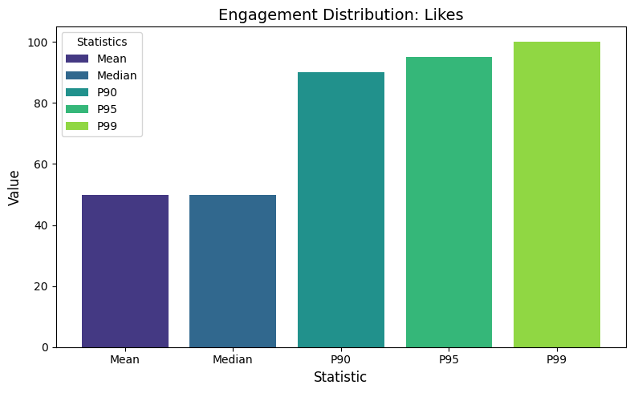

# EDA Financial Discussions - Analysis Report

*Generated: 2026-06-03 16:40:43*

## Executive Summary

This report summarizes the exploratory data analysis conducted to identify suitable datasets for predicting engagement and sentiment surges in stock-related social media discussions.

### Key Findings

- **Datasets discovered:** 0 (0 complete with engagement + sentiment fields)
- **API platforms assessed:** 2
- **Quality reports generated:** 11 (11 suitable)
- **Surge definitions evaluated:** 90 (48 viable with ≥2% positive class)

## Dataset Discovery Results

No datasets were discovered during the scan.

## API Feasibility Findings

### Twitter API

- **Historical access:** No
- **Supports surge label construction:** Yes
- **Estimated collection time:** 0.4 hours
- **Estimated cost:** $100.00
- **Endpoints available:** 5

#### Rate Limits

- free_tier: {'tweets_per_month': 1500, 'requests_per_15min': 15, 'posts_per_request': 100}
- basic_tier: {'tweets_per_month': 10000, 'requests_per_15min': 60, 'posts_per_request': 100}
- pro_tier: {'tweets_per_month': 1000000, 'requests_per_15min': 300, 'posts_per_request': 100}

#### Cost Tiers

| Tier | Details |
|------|---------|
| Free | cost_usd_monthly: 0, tweet_cap: 1500 |
| Basic | cost_usd_monthly: 100, tweet_cap: 10000 |
| Pro | cost_usd_monthly: 5000, tweet_cap: 1000000 |
| Enterprise | cost_usd_monthly: 42000, tweet_cap: 50000000 |

#### Paid Fields

The following fields require paid access:

- **impression_count**: requires Basic ($100/month)
- **full archive search**: requires Pro ($5,000/month)
- **quote_count**: requires Basic ($100/month)

### Reddit API

- **Historical access:** Yes
- **Supports surge label construction:** Yes
- **Estimated collection time:** 0.0 hours
- **Estimated cost:** $0.00
- **Endpoints available:** 7

#### Rate Limits

- oauth_tier: {'requests_per_minute': 100, 'posts_per_request': 100, 'daily_limit': None}
- free_tier_note: Reddit API is free for non-commercial use with OAuth. Commercial use requires paid access.

#### Cost Tiers

| Tier | Details |
|------|---------|
| Free (non-commercial) | cost_usd_monthly: 0, rate_limit: 100 requests/min, note: Requires OAuth app registration |
| Commercial | cost_usd_monthly: Contact Reddit, rate_limit: Higher limits available, note: Required for commercial data use since 2023 API changes |

#### Paid Fields

The following fields require paid access:

- **full historical archive**: requires Commercial (contact Reddit)
- **real-time streaming**: requires Commercial (contact Reddit)

## EDA Statistics

### ./data/StockMarket_subreddit.csv

#### Dataset Structure

- **Records:** 72,620
- **Tickers:** 1597
- **Columns:** 9
- **Date range:** 1970-01-01 to 1970-01-01
- **Recommendation:** suitable

#### Missing Values

| Column | Missing % |
|--------|-----------|
| selftext | 29.2% |

#### Engagement Statistics

| Metric | Mean | Median | P90 | P95 | P99 |
|--------|------|--------|-----|-----|-----|
| score | 6.3 | 1.0 | 7.0 | 16.0 | 97.0 |
| num_comments | 8.1 | 1.0 | 17.0 | 32.0 | 124.0 |

#### Sentiment Statistics

- **mean:** 0.092
- **median:** 0.000
- **std:** 0.305
- **Bullish/Bearish ratio:** 2.48

#### Identified Risks

- Duplicate rows detected: 1103 duplicates (1.5%), which may inflate engagement statistics.

### ./data/goyaladi_twitter-dataset/goyaladi_twitter-dataset.csv

#### Dataset Structure

- **Records:** 10,000
- **Tickers:** 0
- **Columns:** 6
- **Date range:** 2023-01-01 to 2023-05-15
- **Recommendation:** suitable

#### Missing Values

| Column | Missing % |
|--------|-----------|

#### Engagement Statistics

| Metric | Mean | Median | P90 | P95 | P99 |
|--------|------|--------|-----|-----|-----|
| Retweets | 49.7 | 49.0 | 90.0 | 95.0 | 99.0 |
| Likes | 49.9 | 50.0 | 90.0 | 95.0 | 100.0 |

#### Sentiment Statistics

- **mean:** 0.443
- **median:** 0.599
- **std:** 0.452
- **Bullish/Bearish ratio:** 4.72

#### Identified Risks

- No ticker column 'ticker' found and ticker extraction from text yielded no results: per-ticker engagement normalization cannot be performed.

### ./data/leukipp_reddit-finance-data/gme/submissions_reddit.csv

#### Dataset Structure

- **Records:** 273,327
- **Tickers:** 340
- **Columns:** 25
- **Date range:** 2021-01-01 to 2021-12-31
- **Recommendation:** suitable

#### Missing Values

**High-risk columns (>30% missing):** selftext

| Column | Missing % |
|--------|-----------|
| selftext | 48.7% ⚠️ |
| link_flair_text | 7.0% |

#### Engagement Statistics

| Metric | Mean | Median | P90 | P95 | P99 |
|--------|------|--------|-----|-----|-----|
| score | 101.3 | 10.0 | 142.0 | 407.0 | 1868.7 |
| num_comments | 12.5 | 3.0 | 21.0 | 37.0 | 146.0 |

#### Sentiment Statistics

- **mean:** 0.083
- **median:** 0.000
- **std:** 0.361
- **Bullish/Bearish ratio:** 1.82

#### Identified Risks

- High missing data: columns ['selftext'] have >30% missing values, which may bias analysis or require imputation.

### ./data/leukipp_reddit-finance-data/investing/submissions_reddit.csv

#### Dataset Structure

- **Records:** 41,912
- **Tickers:** 990
- **Columns:** 25
- **Date range:** 2021-01-01 to 2021-12-31
- **Recommendation:** suitable

#### Missing Values

**High-risk columns (>30% missing):** link_flair_text

| Column | Missing % |
|--------|-----------|
| link_flair_text | 100.0% ⚠️ |
| selftext | 0.0% |

#### Engagement Statistics

| Metric | Mean | Median | P90 | P95 | P99 |
|--------|------|--------|-----|-----|-----|
| score | 17.8 | 1.0 | 7.0 | 25.0 | 377.7 |
| num_comments | 10.8 | 1.0 | 16.0 | 40.0 | 201.9 |

#### Sentiment Statistics

- **mean:** 0.111
- **median:** 0.000
- **std:** 0.304
- **Bullish/Bearish ratio:** 2.84

#### Identified Risks

- High missing data: columns ['link_flair_text'] have >30% missing values, which may bias analysis or require imputation.

### ./data/leukipp_reddit-finance-data/options/submissions_reddit.csv

#### Dataset Structure

- **Records:** 28,782
- **Tickers:** 624
- **Columns:** 25
- **Date range:** 2021-01-01 to 2021-12-31
- **Recommendation:** suitable

#### Missing Values

**High-risk columns (>30% missing):** link_flair_text

| Column | Missing % |
|--------|-----------|
| link_flair_text | 100.0% ⚠️ |
| selftext | 11.6% |

#### Engagement Statistics

| Metric | Mean | Median | P90 | P95 | P99 |
|--------|------|--------|-----|-----|-----|
| score | 11.3 | 1.0 | 9.0 | 24.0 | 208.0 |
| num_comments | 10.4 | 3.0 | 21.0 | 36.0 | 128.0 |

#### Sentiment Statistics

- **mean:** 0.074
- **median:** 0.000
- **std:** 0.286
- **Bullish/Bearish ratio:** 2.03

#### Identified Risks

- High missing data: columns ['link_flair_text'] have >30% missing values, which may bias analysis or require imputation.

### ./data/leukipp_reddit-finance-data/pennystocks/submissions_reddit.csv

#### Dataset Structure

- **Records:** 54,785
- **Tickers:** 2912
- **Columns:** 25
- **Date range:** 2021-01-01 to 2021-12-31
- **Recommendation:** suitable

#### Missing Values

| Column | Missing % |
|--------|-----------|
| selftext | 20.7% |
| link_flair_text | 1.0% |

#### Engagement Statistics

| Metric | Mean | Median | P90 | P95 | P99 |
|--------|------|--------|-----|-----|-----|
| score | 29.4 | 1.0 | 21.0 | 56.8 | 437.5 |
| num_comments | 10.8 | 1.0 | 21.0 | 39.0 | 137.0 |

#### Sentiment Statistics

- **mean:** 0.118
- **median:** 0.000
- **std:** 0.298
- **Bullish/Bearish ratio:** 3.50

### ./data/leukipp_reddit-finance-data/robinhood/submissions_reddit.csv

#### Dataset Structure

- **Records:** 18,893
- **Tickers:** 294
- **Columns:** 25
- **Date range:** 2021-01-01 to 2021-12-31
- **Recommendation:** suitable

#### Missing Values

**High-risk columns (>30% missing):** link_flair_text

| Column | Missing % |
|--------|-----------|
| link_flair_text | 47.8% ⚠️ |
| selftext | 25.3% |

#### Engagement Statistics

| Metric | Mean | Median | P90 | P95 | P99 |
|--------|------|--------|-----|-----|-----|
| score | 5.5 | 1.0 | 1.0 | 1.0 | 54.1 |
| num_comments | 2.2 | 0.0 | 1.0 | 3.0 | 37.0 |

#### Sentiment Statistics

- **mean:** 0.049
- **median:** 0.000
- **std:** 0.340
- **Bullish/Bearish ratio:** 1.42

#### Identified Risks

- High missing data: columns ['link_flair_text'] have >30% missing values, which may bias analysis or require imputation.

### ./data/leukipp_reddit-finance-data/robinhoodpennystocks/submissions_reddit.csv

#### Dataset Structure

- **Records:** 23,304
- **Tickers:** 855
- **Columns:** 25
- **Date range:** 2021-01-01 to 2021-12-31
- **Recommendation:** suitable

#### Missing Values

**High-risk columns (>30% missing):** link_flair_text, selftext

| Column | Missing % |
|--------|-----------|
| link_flair_text | 46.8% ⚠️ |
| selftext | 36.0% ⚠️ |

#### Engagement Statistics

| Metric | Mean | Median | P90 | P95 | P99 |
|--------|------|--------|-----|-----|-----|
| score | 30.8 | 1.0 | 28.7 | 70.0 | 507.9 |
| num_comments | 9.1 | 0.0 | 22.0 | 39.0 | 115.0 |

#### Sentiment Statistics

- **mean:** 0.098
- **median:** 0.000
- **std:** 0.312
- **Bullish/Bearish ratio:** 2.61

#### Identified Risks

- High missing data: columns ['link_flair_text', 'selftext'] have >30% missing values, which may bias analysis or require imputation.

### ./data/leukipp_reddit-finance-data/stockmarket/submissions_reddit.csv

#### Dataset Structure

- **Records:** 43,809
- **Tickers:** 1475
- **Columns:** 25
- **Date range:** 2021-01-01 to 2021-12-31
- **Recommendation:** suitable

#### Missing Values

**High-risk columns (>30% missing):** selftext

| Column | Missing % |
|--------|-----------|
| selftext | 39.1% ⚠️ |
| link_flair_text | 13.8% |

#### Engagement Statistics

| Metric | Mean | Median | P90 | P95 | P99 |
|--------|------|--------|-----|-----|-----|
| score | 35.0 | 1.0 | 18.0 | 65.0 | 848.9 |
| num_comments | 7.0 | 0.0 | 13.0 | 28.0 | 129.0 |

#### Sentiment Statistics

- **mean:** 0.104
- **median:** 0.000
- **std:** 0.318
- **Bullish/Bearish ratio:** 2.59

#### Identified Risks

- High missing data: columns ['selftext'] have >30% missing values, which may bias analysis or require imputation.

### ./data/leukipp_reddit-finance-data/stocks/submissions_reddit.csv

#### Dataset Structure

- **Records:** 75,857
- **Tickers:** 1963
- **Columns:** 25
- **Date range:** 2021-01-01 to 2021-12-31
- **Recommendation:** suitable

#### Missing Values

**High-risk columns (>30% missing):** link_flair_text

| Column | Missing % |
|--------|-----------|
| link_flair_text | 46.9% ⚠️ |
| selftext | 0.1% |

#### Engagement Statistics

| Metric | Mean | Median | P90 | P95 | P99 |
|--------|------|--------|-----|-----|-----|
| score | 30.2 | 1.0 | 14.0 | 39.0 | 413.0 |
| num_comments | 14.8 | 1.0 | 26.0 | 51.0 | 250.4 |

#### Sentiment Statistics

- **mean:** 0.085
- **median:** 0.000
- **std:** 0.282
- **Bullish/Bearish ratio:** 2.53

#### Identified Risks

- High missing data: columns ['link_flair_text'] have >30% missing values, which may bias analysis or require imputation.

### ./data/leukipp_reddit-finance-data/wallstreetbets/submissions_reddit.csv

#### Dataset Structure

- **Records:** 775,326
- **Tickers:** 4451
- **Columns:** 25
- **Date range:** 2021-01-01 to 2021-12-31
- **Recommendation:** suitable

#### Missing Values

**High-risk columns (>30% missing):** selftext

| Column | Missing % |
|--------|-----------|
| selftext | 33.8% ⚠️ |
| link_flair_text | 1.7% |
| title | 0.0% |

#### Engagement Statistics

| Metric | Mean | Median | P90 | P95 | P99 |
|--------|------|--------|-----|-----|-----|
| score | 116.0 | 1.0 | 21.0 | 70.0 | 964.0 |
| num_comments | 24.6 | 1.0 | 11.0 | 29.0 | 164.0 |

#### Sentiment Statistics

- **mean:** 0.070
- **median:** 0.000
- **std:** 0.340
- **Bullish/Bearish ratio:** 1.80

#### Identified Risks

- High missing data: columns ['selftext'] have >30% missing values, which may bias analysis or require imputation.

## Surge Analysis Results

Surge definitions were evaluated across multiple threshold combinations.

| Engagement Percentile | Sentiment Std Devs | Window (hrs) | Surge Count | Total Posts | Surge % | Imbalance Ratio | Viable |
|----------------------|-------------------|--------------|------------|-------------|---------|-----------------|--------|
| 0.90 | 0.5 | 24 | 6,171 | 72,620 | 8.50% | 10.8:1 | ✓ |
| 0.90 | 1.0 | 24 | 4,411 | 72,620 | 6.07% | 15.5:1 | ✓ |
| 0.90 | 1.5 | 24 | 2,483 | 72,620 | 3.42% | 28.2:1 | ✓ |
| 0.95 | 0.5 | 24 | 3,521 | 72,620 | 4.85% | 19.6:1 | ✓ |
| 0.95 | 1.0 | 24 | 2,388 | 72,620 | 3.29% | 29.4:1 | ✓ |
| 0.95 | 1.5 | 24 | 1,371 | 72,620 | 1.89% | 52.0:1 | ✗ |
| 0.99 | 0.5 | 24 | 1,505 | 72,620 | 2.07% | 47.3:1 | ✓ |
| 0.99 | 1.0 | 24 | 794 | 72,620 | 1.09% | 90.5:1 | ✗ |
| 0.99 | 1.5 | 24 | 418 | 72,620 | 0.58% | 172.7:1 | ✗ |
| 0.90 | 0.5 | 24 | 20,350 | 273,327 | 7.45% | 12.4:1 | ✓ |
| 0.90 | 1.0 | 24 | 14,104 | 273,327 | 5.16% | 18.4:1 | ✓ |
| 0.90 | 1.5 | 24 | 8,176 | 273,327 | 2.99% | 32.4:1 | ✓ |
| 0.95 | 0.5 | 24 | 10,219 | 273,327 | 3.74% | 25.7:1 | ✓ |
| 0.95 | 1.0 | 24 | 7,146 | 273,327 | 2.61% | 37.2:1 | ✓ |
| 0.95 | 1.5 | 24 | 4,187 | 273,327 | 1.53% | 64.3:1 | ✗ |
| 0.99 | 0.5 | 24 | 2,126 | 273,327 | 0.78% | 127.6:1 | ✗ |
| 0.99 | 1.0 | 24 | 1,558 | 273,327 | 0.57% | 174.4:1 | ✗ |
| 0.99 | 1.5 | 24 | 968 | 273,327 | 0.35% | 281.4:1 | ✗ |
| 0.90 | 0.5 | 24 | 2,255 | 41,912 | 5.38% | 17.6:1 | ✓ |
| 0.90 | 1.0 | 24 | 1,341 | 41,912 | 3.20% | 30.3:1 | ✓ |
| 0.90 | 1.5 | 24 | 730 | 41,912 | 1.74% | 56.4:1 | ✗ |
| 0.95 | 0.5 | 24 | 1,225 | 41,912 | 2.92% | 33.2:1 | ✓ |
| 0.95 | 1.0 | 24 | 697 | 41,912 | 1.66% | 59.1:1 | ✗ |
| 0.95 | 1.5 | 24 | 381 | 41,912 | 0.91% | 109.0:1 | ✗ |
| 0.99 | 0.5 | 24 | 352 | 41,912 | 0.84% | 118.1:1 | ✗ |
| 0.99 | 1.0 | 24 | 190 | 41,912 | 0.45% | 219.6:1 | ✗ |
| 0.99 | 1.5 | 24 | 98 | 41,912 | 0.23% | 426.7:1 | ✗ |
| 0.90 | 0.5 | 24 | 1,429 | 28,782 | 4.96% | 19.1:1 | ✓ |
| 0.90 | 1.0 | 24 | 1,078 | 28,782 | 3.75% | 25.7:1 | ✓ |
| 0.90 | 1.5 | 24 | 588 | 28,782 | 2.04% | 47.9:1 | ✓ |
| 0.95 | 0.5 | 24 | 728 | 28,782 | 2.53% | 38.5:1 | ✓ |
| 0.95 | 1.0 | 24 | 548 | 28,782 | 1.90% | 51.5:1 | ✗ |
| 0.95 | 1.5 | 24 | 330 | 28,782 | 1.15% | 86.2:1 | ✗ |
| 0.99 | 0.5 | 24 | 183 | 28,782 | 0.64% | 156.3:1 | ✗ |
| 0.99 | 1.0 | 24 | 132 | 28,782 | 0.46% | 217.0:1 | ✗ |
| 0.99 | 1.5 | 24 | 80 | 28,782 | 0.28% | 358.8:1 | ✗ |
| 0.90 | 0.5 | 24 | 2,869 | 54,785 | 5.24% | 18.1:1 | ✓ |
| 0.90 | 1.0 | 24 | 2,006 | 54,785 | 3.66% | 26.3:1 | ✓ |
| 0.90 | 1.5 | 24 | 1,092 | 54,785 | 1.99% | 49.2:1 | ✗ |
| 0.95 | 0.5 | 24 | 1,634 | 54,785 | 2.98% | 32.5:1 | ✓ |
| 0.95 | 1.0 | 24 | 1,106 | 54,785 | 2.02% | 48.5:1 | ✓ |
| 0.95 | 1.5 | 24 | 589 | 54,785 | 1.08% | 92.0:1 | ✗ |
| 0.99 | 0.5 | 24 | 592 | 54,785 | 1.08% | 91.5:1 | ✗ |
| 0.99 | 1.0 | 24 | 356 | 54,785 | 0.65% | 152.9:1 | ✗ |
| 0.99 | 1.5 | 24 | 163 | 54,785 | 0.30% | 335.1:1 | ✗ |
| 0.90 | 0.5 | 24 | 8,172 | 18,893 | 43.25% | 1.3:1 | ✓ |
| 0.90 | 1.0 | 24 | 6,105 | 18,893 | 32.31% | 2.1:1 | ✓ |
| 0.90 | 1.5 | 24 | 3,031 | 18,893 | 16.04% | 5.2:1 | ✓ |
| 0.95 | 0.5 | 24 | 8,112 | 18,893 | 42.94% | 1.3:1 | ✓ |
| 0.95 | 1.0 | 24 | 6,062 | 18,893 | 32.09% | 2.1:1 | ✓ |
| 0.95 | 1.5 | 24 | 3,016 | 18,893 | 15.96% | 5.3:1 | ✓ |
| 0.99 | 0.5 | 24 | 106 | 18,893 | 0.56% | 177.2:1 | ✗ |
| 0.99 | 1.0 | 24 | 70 | 18,893 | 0.37% | 268.9:1 | ✗ |
| 0.99 | 1.5 | 24 | 30 | 18,893 | 0.16% | 628.8:1 | ✗ |
| 0.90 | 0.5 | 24 | 1,352 | 23,304 | 5.80% | 16.2:1 | ✓ |
| 0.90 | 1.0 | 24 | 994 | 23,304 | 4.27% | 22.4:1 | ✓ |
| 0.90 | 1.5 | 24 | 613 | 23,304 | 2.63% | 37.0:1 | ✓ |
| 0.95 | 0.5 | 24 | 731 | 23,304 | 3.14% | 30.9:1 | ✓ |
| 0.95 | 1.0 | 24 | 506 | 23,304 | 2.17% | 45.1:1 | ✓ |
| 0.95 | 1.5 | 24 | 304 | 23,304 | 1.30% | 75.7:1 | ✗ |
| 0.99 | 0.5 | 24 | 220 | 23,304 | 0.94% | 104.9:1 | ✗ |
| 0.99 | 1.0 | 24 | 117 | 23,304 | 0.50% | 198.2:1 | ✗ |
| 0.99 | 1.5 | 24 | 64 | 23,304 | 0.27% | 363.1:1 | ✗ |
| 0.90 | 0.5 | 24 | 2,645 | 43,809 | 6.04% | 15.6:1 | ✓ |
| 0.90 | 1.0 | 24 | 1,948 | 43,809 | 4.45% | 21.5:1 | ✓ |
| 0.90 | 1.5 | 24 | 1,101 | 43,809 | 2.51% | 38.8:1 | ✓ |
| 0.95 | 0.5 | 24 | 1,344 | 43,809 | 3.07% | 31.6:1 | ✓ |
| 0.95 | 1.0 | 24 | 957 | 43,809 | 2.18% | 44.8:1 | ✓ |
| 0.95 | 1.5 | 24 | 544 | 43,809 | 1.24% | 79.5:1 | ✗ |
| 0.99 | 0.5 | 24 | 366 | 43,809 | 0.84% | 118.7:1 | ✗ |
| 0.99 | 1.0 | 24 | 211 | 43,809 | 0.48% | 206.6:1 | ✗ |
| 0.99 | 1.5 | 24 | 109 | 43,809 | 0.25% | 400.9:1 | ✗ |
| 0.90 | 0.5 | 24 | 4,088 | 75,857 | 5.39% | 17.6:1 | ✓ |
| 0.90 | 1.0 | 24 | 3,176 | 75,857 | 4.19% | 22.9:1 | ✓ |
| 0.90 | 1.5 | 24 | 1,864 | 75,857 | 2.46% | 39.7:1 | ✓ |
| 0.95 | 0.5 | 24 | 2,126 | 75,857 | 2.80% | 34.7:1 | ✓ |
| 0.95 | 1.0 | 24 | 1,626 | 75,857 | 2.14% | 45.7:1 | ✓ |
| 0.95 | 1.5 | 24 | 952 | 75,857 | 1.25% | 78.7:1 | ✗ |
| 0.99 | 0.5 | 24 | 569 | 75,857 | 0.75% | 132.3:1 | ✗ |
| 0.99 | 1.0 | 24 | 379 | 75,857 | 0.50% | 199.2:1 | ✗ |
| 0.99 | 1.5 | 24 | 207 | 75,857 | 0.27% | 365.5:1 | ✗ |
| 0.90 | 0.5 | 24 | 52,040 | 775,326 | 6.71% | 13.9:1 | ✓ |
| 0.90 | 1.0 | 24 | 37,925 | 775,326 | 4.89% | 19.4:1 | ✓ |
| 0.90 | 1.5 | 24 | 21,228 | 775,326 | 2.74% | 35.5:1 | ✓ |
| 0.95 | 0.5 | 24 | 26,971 | 775,326 | 3.48% | 27.7:1 | ✓ |
| 0.95 | 1.0 | 24 | 19,574 | 775,326 | 2.52% | 38.6:1 | ✓ |
| 0.95 | 1.5 | 24 | 10,901 | 775,326 | 1.41% | 70.1:1 | ✗ |
| 0.99 | 0.5 | 24 | 6,010 | 775,326 | 0.78% | 128.0:1 | ✗ |
| 0.99 | 1.0 | 24 | 4,048 | 775,326 | 0.52% | 190.5:1 | ✗ |
| 0.99 | 1.5 | 24 | 2,186 | 775,326 | 0.28% | 353.7:1 | ✗ |

**48 viable surge definition(s)** found (positive class ≥ 2%).

Best viable definition: engagement ≥ 90% percentile + sentiment shift ≥ 0.5 std devs → 43.25% surge rate.

## Visualizations

### Engagement Distribution Score

### Engagement Distribution Num Comments

### Sentiment Class Distribution

### Sentiment Polarity Stats

### Engagement Distribution Retweets

### Engagement Distribution Likes

### Sentiment Class Distribution

### Sentiment Polarity Stats

### Engagement Distribution Score

### Engagement Distribution Num Comments

### Sentiment Class Distribution

### Sentiment Polarity Stats

### Engagement Distribution Score

### Engagement Distribution Num Comments

### Sentiment Class Distribution

### Sentiment Polarity Stats

### Engagement Distribution Score

### Engagement Distribution Num Comments

### Sentiment Class Distribution

### Sentiment Polarity Stats

### Engagement Distribution Score

### Engagement Distribution Num Comments

### Sentiment Class Distribution

### Sentiment Polarity Stats

### Engagement Distribution Score

### Engagement Distribution Num Comments

### Sentiment Class Distribution

### Sentiment Polarity Stats

### Engagement Distribution Score

### Engagement Distribution Num Comments

### Sentiment Class Distribution

### Sentiment Polarity Stats

### Engagement Distribution Score

### Engagement Distribution Num Comments

### Sentiment Class Distribution

### Sentiment Polarity Stats

### Engagement Distribution Score

### Engagement Distribution Num Comments

### Sentiment Class Distribution

### Sentiment Polarity Stats

### Engagement Distribution Score

### Engagement Distribution Num Comments

### Sentiment Class Distribution

### Sentiment Polarity Stats

### Surge Frequency

## Pipeline Performance

### Stage Timings

| Stage | Duration (s) |
|-------|-------------|
| Dataset Discovery | 42.15 |
| API Feasibility | 0.00 |
| Dataset Preparation | 144.30 |
| Dataset Quality | 504.49 |
| Surge Analysis | 263.02 |
| Visualization | 12.05 |
| **Total** | **966.02** |

### Per-Dataset Processing Time

| Dataset | Duration (s) |
|---------|-------------|
| ./data/StockMarket_subreddit.csv | 29.36 |
| ./data/goyaladi_twitter-dataset/goyaladi_twitter-dataset.csv | 8.68 |
| ./data/leukipp_reddit-finance-data/gme/submissions_reddit.csv | 107.18 |
| ./data/leukipp_reddit-finance-data/investing/submissions_reddit.csv | 15.16 |
| ./data/leukipp_reddit-finance-data/options/submissions_reddit.csv | 10.27 |
| ./data/leukipp_reddit-finance-data/pennystocks/submissions_reddit.csv | 18.95 |
| ./data/leukipp_reddit-finance-data/robinhood/submissions_reddit.csv | 6.91 |
| ./data/leukipp_reddit-finance-data/robinhoodpennystocks/submissions_reddit.csv | 7.99 |
| ./data/leukipp_reddit-finance-data/stockmarket/submissions_reddit.csv | 14.84 |
| ./data/leukipp_reddit-finance-data/stocks/submissions_reddit.csv | 23.26 |
| ./data/leukipp_reddit-finance-data/wallstreetbets/submissions_reddit.csv | 261.88 |

## Final Recommendation

### Recommended Path: API Collection (reddit API)

Recommend API collection via 'reddit API' as the best data path. Key strengths: reasonable cost, supports surge label construction, historical data access available. API collection provides fresh, customizable data tailored to the prediction task. Surge analysis confirms viable definitions exist (48/90 configurations produce ≥2% positive class).

### Ranked Options

1. **reddit API** (overall score: 1.000)
   - Low cost for data collection
   - Fast collection time
   - Supports surge label construction
   - Some fields require paid access: full historical archive, real-time streaming

   **Scoring Breakdown:**

   | Criterion | Score | Weight | Comment |
   |-----------|-------|--------|---------|
   | Cost | 1.00 | 25% | Free access |
   | Collection Time | 1.00 | 20% | Very fast (≤1 hour) |
   | Feasibility | 1.00 | 25% | Supports surge label construction |
   | Historical Access | 1.00 | 15% | Historical data access available |
   | Field Availability | 1.00 | 15% | Rich field set (10+ fields) |

2. **./data/leukipp_reddit-finance-data/pennystocks/submissions_reddit.csv** (overall score: 0.960)
   - High data completeness with few missing values
   - Large dataset suitable for model training
   - Good temporal coverage with minimal gaps

   **Scoring Breakdown:**

   | Criterion | Score | Weight | Comment |
   |-----------|-------|--------|---------|
   | Completeness | 1.00 | 25% | Excellent - very few missing values |
   | Volume | 0.80 | 20% | Good - 10k-100k records |
   | Temporal Coverage | 1.00 | 20% | No temporal gaps detected |
   | Ticker Diversity | 1.00 | 15% | Excellent - 50+ tickers covered |
   | Risk | 1.00 | 20% | No risks identified |

3. **./data/leukipp_reddit-finance-data/gme/submissions_reddit.csv** (overall score: 0.960)
   - High data completeness with few missing values
   - Large dataset suitable for model training
   - Good temporal coverage with minimal gaps
   - 1 risk(s) identified: High missing data: columns ['selftext'] have >30% missing values, which may bias analysis or require imputation.

   **Scoring Breakdown:**

   | Criterion | Score | Weight | Comment |
   |-----------|-------|--------|---------|
   | Completeness | 0.96 | 25% | Excellent - very few missing values |
   | Volume | 1.00 | 20% | Excellent - 100k+ records |
   | Temporal Coverage | 1.00 | 20% | No temporal gaps detected |
   | Ticker Diversity | 1.00 | 15% | Excellent - 50+ tickers covered |
   | Risk | 0.85 | 20% | Minor risks (1-2 issues) |

4. **./data/leukipp_reddit-finance-data/wallstreetbets/submissions_reddit.csv** (overall score: 0.960)
   - High data completeness with few missing values
   - Large dataset suitable for model training
   - Good temporal coverage with minimal gaps
   - 1 risk(s) identified: High missing data: columns ['selftext'] have >30% missing values, which may bias analysis or require imputation.

   **Scoring Breakdown:**

   | Criterion | Score | Weight | Comment |
   |-----------|-------|--------|---------|
   | Completeness | 0.96 | 25% | Excellent - very few missing values |
   | Volume | 1.00 | 20% | Excellent - 100k+ records |
   | Temporal Coverage | 1.00 | 20% | No temporal gaps detected |
   | Ticker Diversity | 1.00 | 15% | Excellent - 50+ tickers covered |
   | Risk | 0.85 | 20% | Minor risks (1-2 issues) |

5. **./data/StockMarket_subreddit.csv** (overall score: 0.930)
   - High data completeness with few missing values
   - Large dataset suitable for model training
   - Good temporal coverage with minimal gaps
   - 1 risk(s) identified: Duplicate rows detected: 1103 duplicates (1.5%), which may inflate engagement statistics.

   **Scoring Breakdown:**

   | Criterion | Score | Weight | Comment |
   |-----------|-------|--------|---------|
   | Completeness | 1.00 | 25% | Excellent - very few missing values |
   | Volume | 0.80 | 20% | Good - 10k-100k records |
   | Temporal Coverage | 1.00 | 20% | No temporal gaps detected |
   | Ticker Diversity | 1.00 | 15% | Excellent - 50+ tickers covered |
   | Risk | 0.85 | 20% | Minor risks (1-2 issues) |

6. **./data/leukipp_reddit-finance-data/investing/submissions_reddit.csv** (overall score: 0.920)
   - High data completeness with few missing values
   - Large dataset suitable for model training
   - Good temporal coverage with minimal gaps
   - 1 risk(s) identified: High missing data: columns ['link_flair_text'] have >30% missing values, which may bias analysis or require imputation.

   **Scoring Breakdown:**

   | Criterion | Score | Weight | Comment |
   |-----------|-------|--------|---------|
   | Completeness | 0.96 | 25% | Excellent - very few missing values |
   | Volume | 0.80 | 20% | Good - 10k-100k records |
   | Temporal Coverage | 1.00 | 20% | No temporal gaps detected |
   | Ticker Diversity | 1.00 | 15% | Excellent - 50+ tickers covered |
   | Risk | 0.85 | 20% | Minor risks (1-2 issues) |

7. **./data/leukipp_reddit-finance-data/options/submissions_reddit.csv** (overall score: 0.920)
   - High data completeness with few missing values
   - Large dataset suitable for model training
   - Good temporal coverage with minimal gaps
   - 1 risk(s) identified: High missing data: columns ['link_flair_text'] have >30% missing values, which may bias analysis or require imputation.

   **Scoring Breakdown:**

   | Criterion | Score | Weight | Comment |
   |-----------|-------|--------|---------|
   | Completeness | 0.96 | 25% | Excellent - very few missing values |
   | Volume | 0.80 | 20% | Good - 10k-100k records |
   | Temporal Coverage | 1.00 | 20% | No temporal gaps detected |
   | Ticker Diversity | 1.00 | 15% | Excellent - 50+ tickers covered |
   | Risk | 0.85 | 20% | Minor risks (1-2 issues) |

8. **./data/leukipp_reddit-finance-data/robinhood/submissions_reddit.csv** (overall score: 0.920)
   - High data completeness with few missing values
   - Large dataset suitable for model training
   - Good temporal coverage with minimal gaps
   - 1 risk(s) identified: High missing data: columns ['link_flair_text'] have >30% missing values, which may bias analysis or require imputation.

   **Scoring Breakdown:**

   | Criterion | Score | Weight | Comment |
   |-----------|-------|--------|---------|
   | Completeness | 0.96 | 25% | Excellent - very few missing values |
   | Volume | 0.80 | 20% | Good - 10k-100k records |
   | Temporal Coverage | 1.00 | 20% | No temporal gaps detected |
   | Ticker Diversity | 1.00 | 15% | Excellent - 50+ tickers covered |
   | Risk | 0.85 | 20% | Minor risks (1-2 issues) |

9. **./data/leukipp_reddit-finance-data/stockmarket/submissions_reddit.csv** (overall score: 0.920)
   - High data completeness with few missing values
   - Large dataset suitable for model training
   - Good temporal coverage with minimal gaps
   - 1 risk(s) identified: High missing data: columns ['selftext'] have >30% missing values, which may bias analysis or require imputation.

   **Scoring Breakdown:**

   | Criterion | Score | Weight | Comment |
   |-----------|-------|--------|---------|
   | Completeness | 0.96 | 25% | Excellent - very few missing values |
   | Volume | 0.80 | 20% | Good - 10k-100k records |
   | Temporal Coverage | 1.00 | 20% | No temporal gaps detected |
   | Ticker Diversity | 1.00 | 15% | Excellent - 50+ tickers covered |
   | Risk | 0.85 | 20% | Minor risks (1-2 issues) |

10. **./data/leukipp_reddit-finance-data/stocks/submissions_reddit.csv** (overall score: 0.920)
   - High data completeness with few missing values
   - Large dataset suitable for model training
   - Good temporal coverage with minimal gaps
   - 1 risk(s) identified: High missing data: columns ['link_flair_text'] have >30% missing values, which may bias analysis or require imputation.

   **Scoring Breakdown:**

   | Criterion | Score | Weight | Comment |
   |-----------|-------|--------|---------|
   | Completeness | 0.96 | 25% | Excellent - very few missing values |
   | Volume | 0.80 | 20% | Good - 10k-100k records |
   | Temporal Coverage | 1.00 | 20% | No temporal gaps detected |
   | Ticker Diversity | 1.00 | 15% | Excellent - 50+ tickers covered |
   | Risk | 0.85 | 20% | Minor risks (1-2 issues) |

11. **./data/leukipp_reddit-finance-data/robinhoodpennystocks/submissions_reddit.csv** (overall score: 0.910)
   - High data completeness with few missing values
   - Large dataset suitable for model training
   - Good temporal coverage with minimal gaps
   - 1 risk(s) identified: High missing data: columns ['link_flair_text', 'selftext'] have >30% missing values, which may bias analysis or require imputation.

   **Scoring Breakdown:**

   | Criterion | Score | Weight | Comment |
   |-----------|-------|--------|---------|
   | Completeness | 0.92 | 25% | Excellent - very few missing values |
   | Volume | 0.80 | 20% | Good - 10k-100k records |
   | Temporal Coverage | 1.00 | 20% | No temporal gaps detected |
   | Ticker Diversity | 1.00 | 15% | Excellent - 50+ tickers covered |
   | Risk | 0.85 | 20% | Minor risks (1-2 issues) |

12. **./data/goyaladi_twitter-dataset/goyaladi_twitter-dataset.csv** (overall score: 0.810)
   - High data completeness with few missing values
   - Large dataset suitable for model training
   - Good temporal coverage with minimal gaps
   - 1 risk(s) identified: No ticker column 'ticker' found and ticker extraction from text yielded no results: per-ticker engagement normalization cannot be performed.

   **Scoring Breakdown:**

   | Criterion | Score | Weight | Comment |
   |-----------|-------|--------|---------|
   | Completeness | 1.00 | 25% | Excellent - very few missing values |
   | Volume | 0.80 | 20% | Good - 10k-100k records |
   | Temporal Coverage | 1.00 | 20% | No temporal gaps detected |
   | Ticker Diversity | 0.20 | 15% | Very limited - fewer than 3 tickers |
   | Risk | 0.85 | 20% | Minor risks (1-2 issues) |

13. **twitter API** (overall score: 0.770)
   - Fast collection time
   - Supports surge label construction
   - No historical data access - requires prospective collection
   - Some fields require paid access: impression_count, full archive search, quote_count

   **Scoring Breakdown:**

   | Criterion | Score | Weight | Comment |
   |-----------|-------|--------|---------|
   | Cost | 0.50 | 25% | Moderate cost ($50-$200) |
   | Collection Time | 1.00 | 20% | Very fast (≤1 hour) |
   | Feasibility | 1.00 | 25% | Supports surge label construction |
   | Historical Access | 0.30 | 15% | No historical access - prospective only |
   | Field Availability | 1.00 | 15% | Rich field set (10+ fields) |

