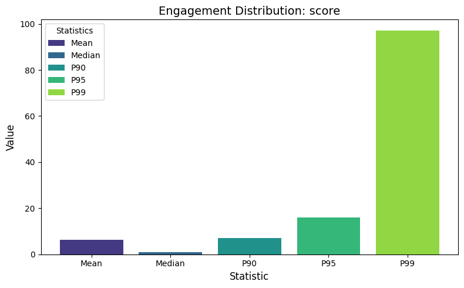
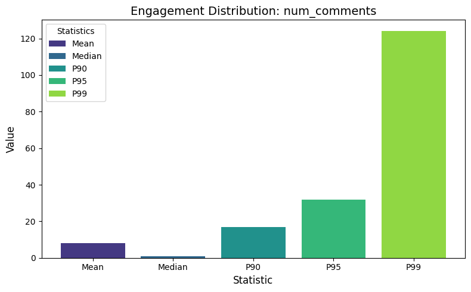
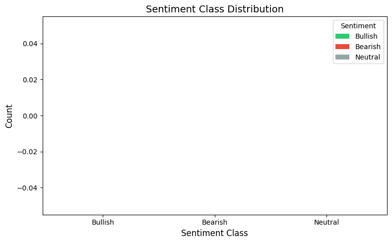
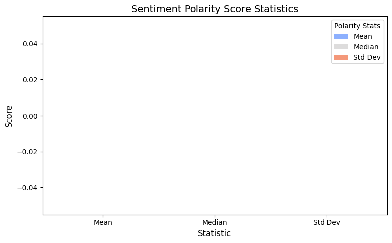

# EDA Financial Discussions - Analysis Report

*Generated: 2026-05-30 17:50:00*

## Executive Summary

This report summarizes the exploratory data analysis conducted to identify suitable datasets for predicting engagement and sentiment surges in stock-related social media discussions.

### Key Findings

- **Datasets discovered:** 0 (0 complete with engagement + sentiment fields)
- **API platforms assessed:** 2
- **Quality reports generated:** 1 (1 suitable)
- **Surge definitions evaluated:** 0 (0 viable with ≥2% positive class)

## Dataset Discovery Results

No datasets were discovered during the scan.

## API Feasibility Findings

### Twitter API

- **Historical access:** No
- **Supports surge label construction:** Yes
- **Estimated collection time:** 0.4 hours
- **Estimated cost:** $100.00
- **Endpoints available:** 5

#### Rate Limits

- free_tier: {'tweets_per_month': 1500, 'requests_per_15min': 15, 'posts_per_request': 100}
- basic_tier: {'tweets_per_month': 10000, 'requests_per_15min': 60, 'posts_per_request': 100}
- pro_tier: {'tweets_per_month': 1000000, 'requests_per_15min': 300, 'posts_per_request': 100}

#### Cost Tiers

| Tier | Details |
|------|---------|
| Free | cost_usd_monthly: 0, tweet_cap: 1500 |
| Basic | cost_usd_monthly: 100, tweet_cap: 10000 |
| Pro | cost_usd_monthly: 5000, tweet_cap: 1000000 |
| Enterprise | cost_usd_monthly: 42000, tweet_cap: 50000000 |

#### Paid Fields

The following fields require paid access:

- **impression_count**: requires Basic ($100/month)
- **full archive search**: requires Pro ($5,000/month)
- **quote_count**: requires Basic ($100/month)

### Reddit API

- **Historical access:** Yes
- **Supports surge label construction:** Yes
- **Estimated collection time:** 0.0 hours
- **Estimated cost:** $0.00
- **Endpoints available:** 7

#### Rate Limits

- oauth_tier: {'requests_per_minute': 100, 'posts_per_request': 100, 'daily_limit': None}
- free_tier_note: Reddit API is free for non-commercial use with OAuth. Commercial use requires paid access.

#### Cost Tiers

| Tier | Details |
|------|---------|
| Free (non-commercial) | cost_usd_monthly: 0, rate_limit: 100 requests/min, note: Requires OAuth app registration |
| Commercial | cost_usd_monthly: Contact Reddit, rate_limit: Higher limits available, note: Required for commercial data use since 2023 API changes |

#### Paid Fields

The following fields require paid access:

- **full historical archive**: requires Commercial (contact Reddit)
- **real-time streaming**: requires Commercial (contact Reddit)

## EDA Statistics

### StockMarket_subreddit.csv

#### Dataset Structure

- **Records:** 72,620
- **Tickers:** 0
- **Columns:** 7
- **Date range:** 1970-01-01 to 1970-01-01
- **Recommendation:** suitable

#### Missing Values

| Column | Missing % |
|--------|-----------|
| selftext | 29.2% |

#### Engagement Statistics

| Metric | Mean | Median | P90 | P95 | P99 |
|--------|------|--------|-----|-----|-----|
| score | 6.3 | 1.0 | 7.0 | 16.0 | 97.0 |
| num_comments | 8.1 | 1.0 | 17.0 | 32.0 | 124.0 |

#### Sentiment Statistics

- **mean:** 0.000
- **median:** 0.000
- **std:** 0.000
- **Bullish/Bearish ratio:** 0.00

#### Identified Risks

- Duplicate rows detected: 1103 duplicates (1.5%), which may inflate engagement statistics.
- No ticker column 'ticker' found: per-ticker engagement normalization cannot be performed.

## Surge Analysis Results

No surge analysis was performed.

## Visualizations

### Engagement Distribution Score

### Engagement Distribution Num Comments

### Sentiment Class Distribution

### Sentiment Polarity Stats

## Final Recommendation

### Recommended Path: API Collection (reddit API)

Recommend API collection via 'reddit API' as the best data path. Key strengths: reasonable cost, supports surge label construction, historical data access available. API collection provides fresh, customizable data tailored to the prediction task.

### Ranked Options

1. **reddit API** (score: 1.000)
   - Low cost for data collection
   - Fast collection time
   - Supports surge label construction
   - Some fields require paid access: full historical archive, real-time streaming
2. **StockMarket_subreddit.csv** (score: 0.780)
   - High data completeness with few missing values
   - Large dataset suitable for model training
   - Good temporal coverage with minimal gaps
   - 2 risk(s) identified: Duplicate rows detected: 1103 duplicates (1.5%), which may inflate engagement statistics., No ticker column 'ticker' found: per-ticker engagement normalization cannot be performed.
3. **twitter API** (score: 0.770)
   - Fast collection time
   - Supports surge label construction
   - No historical data access - requires prospective collection
   - Some fields require paid access: impression_count, full archive search, quote_count
