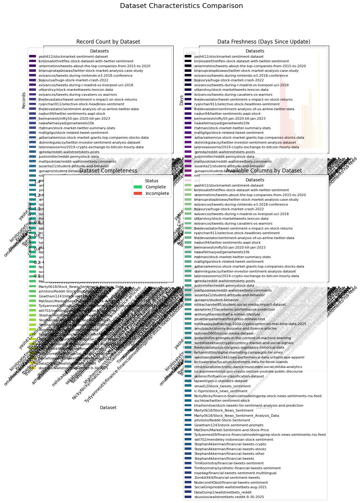

# EDA Financial Discussions - Analysis Report

*Generated: 2026-05-30 21:53:08*

## Executive Summary

This report summarizes the exploratory data analysis conducted to identify suitable datasets for predicting engagement and sentiment surges in stock-related social media discussions.

### Key Findings

- **Datasets discovered:** 66 (0 complete with engagement + sentiment fields)
- **API platforms assessed:** 2
- **Quality reports generated:** 1 (1 suitable)
- **Surge definitions evaluated:** 0 (0 viable with ≥2% positive class)

## Dataset Discovery Results

A total of **66** datasets were discovered across 2 platform(s).

### Kaggle Datasets

| Name | Records | Downloads | Date Range | Freshness (days) | Complete |
|------|---------|-----------|------------|------------------|----------|
| yash612/stockmarket-sentiment-dataset | 0 | 0 | unknown to unknown | -1 | ✗ |
| kirolosatef/netflex-stock-dataset-with-twitter-sentiment | 0 | 0 | unknown to unknown | -1 | ✗ |
| omermetinn/tweets-about-the-top-companies-from-2015-to-2020 | 0 | 0 | unknown to unknown | -1 | ✗ |
| bhanupratapbiswas/twitter-stock-market-analysis-case-study | 0 | 0 | unknown to unknown | -1 | ✗ |
| xvivancos/tweets-during-nintendo-e3-2018-conference | 0 | 0 | unknown to unknown | -1 | ✗ |
| tejasurya/huge-stock-market-crash-2022 | 0 | 0 | unknown to unknown | -1 | ✗ |
| xvivancos/tweets-during-r-madrid-vs-liverpool-ucl-2018 | 0 | 0 | unknown to unknown | -1 | ✗ |
| utkarshxy/stock-markettweets-lexicon-data | 0 | 0 | unknown to unknown | -1 | ✗ |
| xvivancos/tweets-during-cavaliers-vs-warriors | 0 | 0 | unknown to unknown | -1 | ✗ |
| thedevastator/tweet-sentiment-s-impact-on-stock-returns | 0 | 0 | unknown to unknown | -1 | ✗ |
| ryanchan911/selective-stock-headlines-sentiment | 0 | 0 | unknown to unknown | -1 | ✗ |
| thedevastator/sentiment-analysis-of-us-airline-twitter-data | 0 | 0 | unknown to unknown | -1 | ✗ |
| nadun94/twitter-sentiments-aapl-stock | 0 | 0 | unknown to unknown | -1 | ✗ |
| berinaniesh/nifty50-jan-2020-till-jan-2023 | 0 | 0 | unknown to unknown | -1 | ✗ |
| nawafalmazyad/genaitweets10k | 0 | 0 | unknown to unknown | -1 | ✗ |
| rtatman/stock-market-twitter-summary-stats | 0 | 0 | unknown to unknown | -1 | ✗ |
| mattgilgo/stock-related-tweet-sentiment | 0 | 0 | unknown to unknown | -1 | ✗ |
| azharsaleem/us-stock-market-giants-top-companies-stocks-data | 0 | 0 | unknown to unknown | -1 | ✗ |
| dominikgulacsy/twitter-investor-sentiment-analysis-dataset | 0 | 0 | unknown to unknown | -1 | ✗ |
| lalorosasosorno/2019-crypto-exchange-to-bitcoin-hourly-data | 0 | 0 | unknown to unknown | -1 | ✗ |
| gpreda/reddit-wallstreetsbets-posts | 0 | 0 | unknown to unknown | -1 | ✗ |
| justinmiller/reddit-pennystock-data | 0 | 0 | unknown to unknown | -1 | ✗ |
| mattpodolak/reddit-wallstreetbets-comments | 0 | 0 | unknown to unknown | -1 | ✗ |
| susanta21/student-attitude-and-behavior | 0 | 0 | unknown to unknown | -1 | ✗ |
| gunapro/student-behavior | 0 | 0 | unknown to unknown | -1 | ✗ |
| nitikachandel95/student-social-media-impact-dataset | 0 | 0 | unknown to unknown | -1 | ✗ |
| aiexplorer77/academic-performance-prediction | 0 | 0 | unknown to unknown | -1 | ✗ |
| anthonytherrien/half-a-million-lifestyle | 0 | 0 | unknown to unknown | -1 | ✗ |
| jonathanpaserman/fed-press-release-text | 0 | 0 | unknown to unknown | -1 | ✗ |
| mihikaajayjadhav/top-1000-cryptocurrencies-real-time-data-2025 | 0 | 0 | unknown to unknown | -1 | ✗ |
| amulyas/economy-business-and-finance-articles | 0 | 0 | unknown to unknown | -1 | ✗ |
| lastman0800/social-media-dataset | 0 | 0 | unknown to unknown | -1 | ✗ |
| jordanln/llm-prompts-in-the-context-of-machine-learning | 0 | 0 | unknown to unknown | -1 | ✗ |
| sureshbeekhani/cryptocurrency-market-and-social-signals | 0 | 0 | unknown to unknown | -1 | ✗ |
| thedevastator/us-congress-legislators-historical-data | 0 | 0 | unknown to unknown | -1 | ✗ |
| farhanmittho/digital-marketing-campaigns-for-smes | 0 | 0 | unknown to unknown | -1 | ✗ |
| sakshiandhale62442/seo-performance-data-urbanscape-apparel | 0 | 0 | unknown to unknown | -1 | ✗ |
| techsalerator/location-sentiment-data-for-faroe-islands | 0 | 0 | unknown to unknown | -1 | ✗ |
| rithikmurali/electronic-dance-musicedm-social-media-analytics | 0 | 0 | unknown to unknown | -1 | ✗ |
| lucaspimeentel/us-gov-crypto-seizure-youtube-public-discourse | 0 | 0 | unknown to unknown | -1 | ✗ |
| akibmir/finfluencer-classification-dataset | 0 | 0 | unknown to unknown | -1 | ✗ |
| tapwell/gen-z-statistics-dataset | 0 | 0 | unknown to unknown | -1 | ✗ |

### HuggingFace Datasets

| Name | Records | Downloads | Date Range | Freshness (days) | Complete |
|------|---------|-----------|------------|------------------|----------|
| emad12/stock_tweets_sentiment | 0 | 22 | unknown to 2023-06-04 | 1091 | ✗ |
| ic-fspml/stock_news_sentiment | 0 | 148 | unknown to 2023-09-15 | 988 | ✗ |
| NickyNicky/finance-financialmodelingprep-stock-news-sentiments-rss-feed | 0 | 114 | unknown to 2023-10-05 | 968 | ✗ |
| suchkow/twitter-sentiment-stock | 0 | 19 | unknown to 2024-06-01 | 727 | ✗ |
| khaihernlow/stock-tweets-for-sentiment-analysis-and-prediction | 0 | 19 | unknown to 2024-11-16 | 559 | ✗ |
| Marty0618/Stock_News_Sentiment | 0 | 9 | unknown to 2025-03-24 | 432 | ✗ |
| Marty0618/Stock_News_Sentiment_Analysis_Data | 0 | 15 | unknown to 2025-03-24 | 432 | ✗ |
| johntoro/Reddit-Stock-Sentiment | 0 | 6 | unknown to 2025-04-15 | 409 | ✗ |
| Gowtham1243/stock-sentiment-prompts | 0 | 2 | unknown to 2025-10-18 | 224 | ✗ |
| MatStein/Market-Sentiment-and-Stock-Price | 0 | 17 | unknown to 2026-01-12 | 138 | ✗ |
| Tydyannes69/finance-financialmodelingprep-stock-news-sentiments-rss-feed | 0 | 28 | unknown to 2026-03-16 | 75 | ✗ |
| will702/mendeley-indonesian-stock-sentiment | 0 | 54 | unknown to 2026-03-31 | 60 | ✗ |
| StephanAkkerman/financial-tweets-crypto | 0 | 140 | unknown to 2024-09-05 | 631 | ✗ |
| StephanAkkerman/financial-tweets-stocks | 0 | 121 | unknown to 2024-09-05 | 631 | ✗ |
| StephanAkkerman/financial-tweets-other | 0 | 45 | unknown to 2024-09-05 | 631 | ✗ |
| StephanAkkerman/financial-tweets | 0 | 96 | unknown to 2024-09-05 | 631 | ✗ |
| TimKoornstra/financial-tweets-sentiment | 0 | 763 | unknown to 2023-12-20 | 892 | ✗ |
| TimKoornstra/synthetic-financial-tweets-sentiment | 0 | 106 | unknown to 2024-02-23 | 827 | ✗ |
| nojedag/financial-tweets-sentiment-multilingual | 0 | 41 | unknown to 2025-05-16 | 378 | ✗ |
| ZombitX64/financial-sentiment-tweets | 0 | 21 | unknown to 2025-08-03 | 300 | ✗ |
| NodecoreHQbot/financial-tweets-sentiment | 0 | 22 | unknown to 2026-05-25 | 4 | ✗ |
| SocialGrep/reddit-wallstreetbets-aug-2021 | 0 | 204 | unknown to 2022-07-01 | 1428 | ✗ |
| DataDump1/wallstreetbets_reddit | 0 | 5 | unknown to 2025-04-05 | 419 | ✗ |
| sbussiso/wallstreetbets-reddit-9-30-2025 | 0 | 63 | unknown to 2025-09-30 | 241 | ✗ |

### Incomplete Datasets

The following datasets are flagged as incomplete for surge prediction (missing engagement metrics or sentiment fields):

- **yash612/stockmarket-sentiment-dataset** (kaggle): missing engagement metrics
- **kirolosatef/netflex-stock-dataset-with-twitter-sentiment** (kaggle): missing engagement metrics
- **omermetinn/tweets-about-the-top-companies-from-2015-to-2020** (kaggle): missing engagement metrics, sentiment fields
- **bhanupratapbiswas/twitter-stock-market-analysis-case-study** (kaggle): missing engagement metrics, sentiment fields
- **xvivancos/tweets-during-nintendo-e3-2018-conference** (kaggle): missing engagement metrics, sentiment fields
- **tejasurya/huge-stock-market-crash-2022** (kaggle): missing engagement metrics, sentiment fields
- **xvivancos/tweets-during-r-madrid-vs-liverpool-ucl-2018** (kaggle): missing engagement metrics, sentiment fields
- **utkarshxy/stock-markettweets-lexicon-data** (kaggle): missing engagement metrics, sentiment fields
- **xvivancos/tweets-during-cavaliers-vs-warriors** (kaggle): missing engagement metrics, sentiment fields
- **thedevastator/tweet-sentiment-s-impact-on-stock-returns** (kaggle): missing engagement metrics
- **ryanchan911/selective-stock-headlines-sentiment** (kaggle): missing engagement metrics
- **thedevastator/sentiment-analysis-of-us-airline-twitter-data** (kaggle): missing engagement metrics
- **nadun94/twitter-sentiments-aapl-stock** (kaggle): missing engagement metrics
- **berinaniesh/nifty50-jan-2020-till-jan-2023** (kaggle): missing engagement metrics, sentiment fields
- **nawafalmazyad/genaitweets10k** (kaggle): missing engagement metrics, sentiment fields
- **rtatman/stock-market-twitter-summary-stats** (kaggle): missing engagement metrics, sentiment fields
- **mattgilgo/stock-related-tweet-sentiment** (kaggle): missing engagement metrics
- **azharsaleem/us-stock-market-giants-top-companies-stocks-data** (kaggle): missing engagement metrics, sentiment fields
- **dominikgulacsy/twitter-investor-sentiment-analysis-dataset** (kaggle): missing engagement metrics
- **lalorosasosorno/2019-crypto-exchange-to-bitcoin-hourly-data** (kaggle): missing engagement metrics, sentiment fields
- **gpreda/reddit-wallstreetsbets-posts** (kaggle): missing engagement metrics, sentiment fields
- **justinmiller/reddit-pennystock-data** (kaggle): missing engagement metrics, sentiment fields
- **mattpodolak/reddit-wallstreetbets-comments** (kaggle): missing sentiment fields
- **susanta21/student-attitude-and-behavior** (kaggle): missing engagement metrics, sentiment fields
- **gunapro/student-behavior** (kaggle): missing engagement metrics, sentiment fields
- **nitikachandel95/student-social-media-impact-dataset** (kaggle): missing engagement metrics, sentiment fields
- **aiexplorer77/academic-performance-prediction** (kaggle): missing engagement metrics, sentiment fields
- **anthonytherrien/half-a-million-lifestyle** (kaggle): missing engagement metrics, sentiment fields
- **jonathanpaserman/fed-press-release-text** (kaggle): missing engagement metrics, sentiment fields
- **mihikaajayjadhav/top-1000-cryptocurrencies-real-time-data-2025** (kaggle): missing engagement metrics, sentiment fields
- **amulyas/economy-business-and-finance-articles** (kaggle): missing engagement metrics, sentiment fields
- **lastman0800/social-media-dataset** (kaggle): missing engagement metrics, sentiment fields
- **jordanln/llm-prompts-in-the-context-of-machine-learning** (kaggle): missing engagement metrics, sentiment fields
- **sureshbeekhani/cryptocurrency-market-and-social-signals** (kaggle): missing engagement metrics, sentiment fields
- **thedevastator/us-congress-legislators-historical-data** (kaggle): missing engagement metrics, sentiment fields
- **farhanmittho/digital-marketing-campaigns-for-smes** (kaggle): missing engagement metrics, sentiment fields
- **sakshiandhale62442/seo-performance-data-urbanscape-apparel** (kaggle): missing engagement metrics, sentiment fields
- **techsalerator/location-sentiment-data-for-faroe-islands** (kaggle): missing engagement metrics
- **rithikmurali/electronic-dance-musicedm-social-media-analytics** (kaggle): missing engagement metrics, sentiment fields
- **lucaspimeentel/us-gov-crypto-seizure-youtube-public-discourse** (kaggle): missing engagement metrics, sentiment fields
- **akibmir/finfluencer-classification-dataset** (kaggle): missing engagement metrics, sentiment fields
- **tapwell/gen-z-statistics-dataset** (kaggle): missing engagement metrics, sentiment fields
- **emad12/stock_tweets_sentiment** (huggingface): missing engagement metrics
- **ic-fspml/stock_news_sentiment** (huggingface): missing engagement metrics
- **NickyNicky/finance-financialmodelingprep-stock-news-sentiments-rss-feed** (huggingface): missing engagement metrics
- **suchkow/twitter-sentiment-stock** (huggingface): missing engagement metrics
- **khaihernlow/stock-tweets-for-sentiment-analysis-and-prediction** (huggingface): missing engagement metrics
- **Marty0618/Stock_News_Sentiment** (huggingface): missing engagement metrics
- **Marty0618/Stock_News_Sentiment_Analysis_Data** (huggingface): missing engagement metrics
- **johntoro/Reddit-Stock-Sentiment** (huggingface): missing engagement metrics
- **Gowtham1243/stock-sentiment-prompts** (huggingface): missing engagement metrics
- **MatStein/Market-Sentiment-and-Stock-Price** (huggingface): missing engagement metrics
- **Tydyannes69/finance-financialmodelingprep-stock-news-sentiments-rss-feed** (huggingface): missing engagement metrics
- **will702/mendeley-indonesian-stock-sentiment** (huggingface): missing engagement metrics
- **StephanAkkerman/financial-tweets-crypto** (huggingface): missing engagement metrics, sentiment fields
- **StephanAkkerman/financial-tweets-stocks** (huggingface): missing engagement metrics, sentiment fields
- **StephanAkkerman/financial-tweets-other** (huggingface): missing engagement metrics, sentiment fields
- **StephanAkkerman/financial-tweets** (huggingface): missing engagement metrics, sentiment fields
- **TimKoornstra/financial-tweets-sentiment** (huggingface): missing engagement metrics
- **TimKoornstra/synthetic-financial-tweets-sentiment** (huggingface): missing engagement metrics
- **nojedag/financial-tweets-sentiment-multilingual** (huggingface): missing engagement metrics
- **ZombitX64/financial-sentiment-tweets** (huggingface): missing engagement metrics
- **NodecoreHQbot/financial-tweets-sentiment** (huggingface): missing engagement metrics
- **SocialGrep/reddit-wallstreetbets-aug-2021** (huggingface): missing engagement metrics, sentiment fields
- **DataDump1/wallstreetbets_reddit** (huggingface): missing engagement metrics, sentiment fields
- **sbussiso/wallstreetbets-reddit-9-30-2025** (huggingface): missing engagement metrics, sentiment fields

## API Feasibility Findings

### Twitter API

- **Historical access:** No
- **Supports surge label construction:** Yes
- **Estimated collection time:** 0.4 hours
- **Estimated cost:** $100.00
- **Endpoints available:** 5

#### Rate Limits

- free_tier: {'tweets_per_month': 1500, 'requests_per_15min': 15, 'posts_per_request': 100}
- basic_tier: {'tweets_per_month': 10000, 'requests_per_15min': 60, 'posts_per_request': 100}
- pro_tier: {'tweets_per_month': 1000000, 'requests_per_15min': 300, 'posts_per_request': 100}

#### Cost Tiers

| Tier | Details |
|------|---------|
| Free | cost_usd_monthly: 0, tweet_cap: 1500 |
| Basic | cost_usd_monthly: 100, tweet_cap: 10000 |
| Pro | cost_usd_monthly: 5000, tweet_cap: 1000000 |
| Enterprise | cost_usd_monthly: 42000, tweet_cap: 50000000 |

#### Paid Fields

The following fields require paid access:

- **impression_count**: requires Basic ($100/month)
- **full archive search**: requires Pro ($5,000/month)
- **quote_count**: requires Basic ($100/month)

### Reddit API

- **Historical access:** Yes
- **Supports surge label construction:** Yes
- **Estimated collection time:** 0.0 hours
- **Estimated cost:** $0.00
- **Endpoints available:** 7

#### Rate Limits

- oauth_tier: {'requests_per_minute': 100, 'posts_per_request': 100, 'daily_limit': None}
- free_tier_note: Reddit API is free for non-commercial use with OAuth. Commercial use requires paid access.

#### Cost Tiers

| Tier | Details |
|------|---------|
| Free (non-commercial) | cost_usd_monthly: 0, rate_limit: 100 requests/min, note: Requires OAuth app registration |
| Commercial | cost_usd_monthly: Contact Reddit, rate_limit: Higher limits available, note: Required for commercial data use since 2023 API changes |

#### Paid Fields

The following fields require paid access:

- **full historical archive**: requires Commercial (contact Reddit)
- **real-time streaming**: requires Commercial (contact Reddit)

## EDA Statistics

### StockMarket_subreddit.csv

#### Dataset Structure

- **Records:** 72,620
- **Tickers:** 0
- **Columns:** 7
- **Date range:** 1970-01-01 to 1970-01-01
- **Recommendation:** suitable

#### Missing Values

| Column | Missing % |
|--------|-----------|
| selftext | 29.2% |

#### Engagement Statistics

| Metric | Mean | Median | P90 | P95 | P99 |
|--------|------|--------|-----|-----|-----|
| score | 6.3 | 1.0 | 7.0 | 16.0 | 97.0 |
| num_comments | 8.1 | 1.0 | 17.0 | 32.0 | 124.0 |

#### Sentiment Statistics

- **mean:** 0.000
- **median:** 0.000
- **std:** 0.000
- **Bullish/Bearish ratio:** 0.00

#### Identified Risks

- Duplicate rows detected: 1103 duplicates (1.5%), which may inflate engagement statistics.
- No ticker column 'ticker' found: per-ticker engagement normalization cannot be performed.

## Surge Analysis Results

No surge analysis was performed.

## Visualizations

### Engagement Distribution Score

### Engagement Distribution Num Comments

### Sentiment Class Distribution

### Sentiment Polarity Stats

### Dataset Comparison

## Final Recommendation

### Recommended Path: API Collection (reddit API)

Recommend API collection via 'reddit API' as the best data path. Key strengths: reasonable cost, supports surge label construction, historical data access available. API collection provides fresh, customizable data tailored to the prediction task.

### Ranked Options

1. **reddit API** (score: 1.000)
   - Low cost for data collection
   - Fast collection time
   - Supports surge label construction
   - Some fields require paid access: full historical archive, real-time streaming
2. **StockMarket_subreddit.csv** (score: 0.780)
   - High data completeness with few missing values
   - Large dataset suitable for model training
   - Good temporal coverage with minimal gaps
   - 2 risk(s) identified: Duplicate rows detected: 1103 duplicates (1.5%), which may inflate engagement statistics., No ticker column 'ticker' found: per-ticker engagement normalization cannot be performed.
3. **twitter API** (score: 0.770)
   - Fast collection time
   - Supports surge label construction
   - No historical data access - requires prospective collection
   - Some fields require paid access: impression_count, full archive search, quote_count
