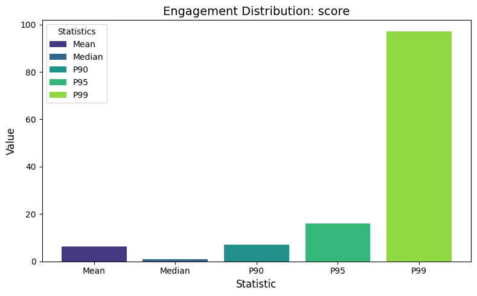
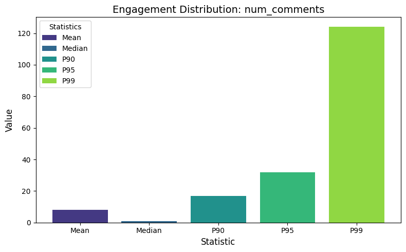
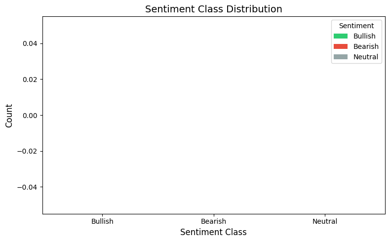
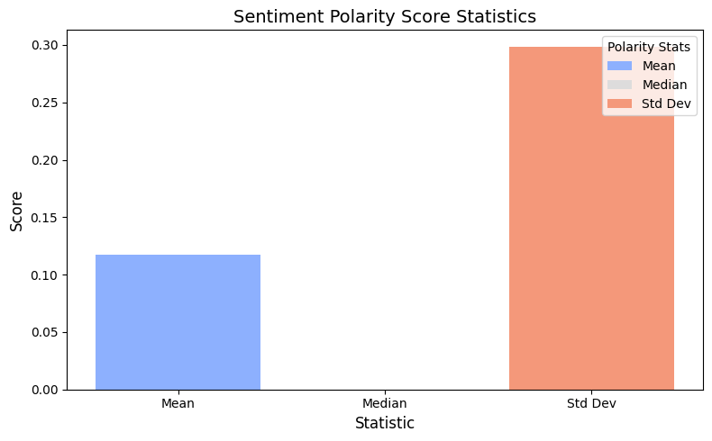
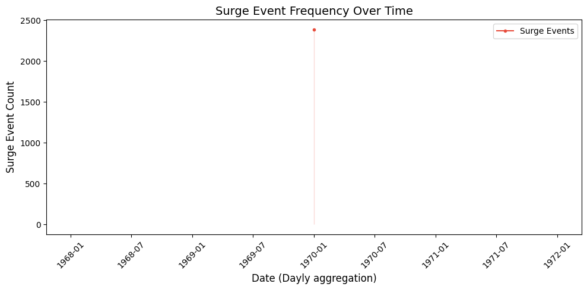

# EDA Financial Discussions - Analysis Report

*Generated: 2026-06-02 17:28:43*

## Executive Summary

This report summarizes the exploratory data analysis conducted to identify suitable datasets for predicting engagement and sentiment surges in stock-related social media discussions.

### Key Findings

- **Datasets discovered:** 0 (0 complete with engagement + sentiment fields)
- **API platforms assessed:** 2
- **Quality reports generated:** 1 (1 suitable)
- **Surge definitions evaluated:** 9 (6 viable with ≥2% positive class)

## Dataset Discovery Results

No datasets were discovered during the scan.

## API Feasibility Findings

### Twitter API

- **Historical access:** No
- **Supports surge label construction:** Yes
- **Estimated collection time:** 0.4 hours
- **Estimated cost:** $100.00
- **Endpoints available:** 5

#### Rate Limits

- free_tier: {'tweets_per_month': 1500, 'requests_per_15min': 15, 'posts_per_request': 100}
- basic_tier: {'tweets_per_month': 10000, 'requests_per_15min': 60, 'posts_per_request': 100}
- pro_tier: {'tweets_per_month': 1000000, 'requests_per_15min': 300, 'posts_per_request': 100}

#### Cost Tiers

| Tier | Details |
|------|---------|
| Free | cost_usd_monthly: 0, tweet_cap: 1500 |
| Basic | cost_usd_monthly: 100, tweet_cap: 10000 |
| Pro | cost_usd_monthly: 5000, tweet_cap: 1000000 |
| Enterprise | cost_usd_monthly: 42000, tweet_cap: 50000000 |

#### Paid Fields

The following fields require paid access:

- **impression_count**: requires Basic ($100/month)
- **full archive search**: requires Pro ($5,000/month)
- **quote_count**: requires Basic ($100/month)

### Reddit API

- **Historical access:** Yes
- **Supports surge label construction:** Yes
- **Estimated collection time:** 0.0 hours
- **Estimated cost:** $0.00
- **Endpoints available:** 7

#### Rate Limits

- oauth_tier: {'requests_per_minute': 100, 'posts_per_request': 100, 'daily_limit': None}
- free_tier_note: Reddit API is free for non-commercial use with OAuth. Commercial use requires paid access.

#### Cost Tiers

| Tier | Details |
|------|---------|
| Free (non-commercial) | cost_usd_monthly: 0, rate_limit: 100 requests/min, note: Requires OAuth app registration |
| Commercial | cost_usd_monthly: Contact Reddit, rate_limit: Higher limits available, note: Required for commercial data use since 2023 API changes |

#### Paid Fields

The following fields require paid access:

- **full historical archive**: requires Commercial (contact Reddit)
- **real-time streaming**: requires Commercial (contact Reddit)

## EDA Statistics

### StockMarket_subreddit.csv

#### Dataset Structure

- **Records:** 72,620
- **Tickers:** 1597
- **Columns:** 9
- **Date range:** 1970-01-01 to 1970-01-01
- **Recommendation:** suitable

#### Missing Values

| Column | Missing % |
|--------|-----------|
| selftext | 29.2% |

#### Engagement Statistics

| Metric | Mean | Median | P90 | P95 | P99 |
|--------|------|--------|-----|-----|-----|
| score | 6.3 | 1.0 | 7.0 | 16.0 | 97.0 |
| num_comments | 8.1 | 1.0 | 17.0 | 32.0 | 124.0 |

#### Sentiment Statistics

- **mean:** 0.092
- **median:** 0.000
- **std:** 0.305
- **Bullish/Bearish ratio:** 2.48

#### Identified Risks

- Duplicate rows detected: 1103 duplicates (1.5%), which may inflate engagement statistics.

## Surge Analysis Results

Surge definitions were evaluated across multiple threshold combinations.

| Engagement Percentile | Sentiment Std Devs | Window (hrs) | Surge Count | Total Posts | Surge % | Imbalance Ratio | Viable |
|----------------------|-------------------|--------------|------------|-------------|---------|-----------------|--------|
| 0.90 | 0.5 | 24 | 6,171 | 72,620 | 8.50% | 10.8:1 | ✓ |
| 0.90 | 1.0 | 24 | 4,411 | 72,620 | 6.07% | 15.5:1 | ✓ |
| 0.90 | 1.5 | 24 | 2,483 | 72,620 | 3.42% | 28.2:1 | ✓ |
| 0.95 | 0.5 | 24 | 3,521 | 72,620 | 4.85% | 19.6:1 | ✓ |
| 0.95 | 1.0 | 24 | 2,388 | 72,620 | 3.29% | 29.4:1 | ✓ |
| 0.95 | 1.5 | 24 | 1,371 | 72,620 | 1.89% | 52.0:1 | ✗ |
| 0.99 | 0.5 | 24 | 1,505 | 72,620 | 2.07% | 47.3:1 | ✓ |
| 0.99 | 1.0 | 24 | 794 | 72,620 | 1.09% | 90.5:1 | ✗ |
| 0.99 | 1.5 | 24 | 418 | 72,620 | 0.58% | 172.7:1 | ✗ |

**6 viable surge definition(s)** found (positive class ≥ 2%).

Best viable definition: engagement ≥ 90% percentile + sentiment shift ≥ 0.5 std devs → 8.50% surge rate.

## Visualizations

### Engagement Distribution Score

### Engagement Distribution Num Comments

### Sentiment Class Distribution

### Sentiment Polarity Stats

### Surge Frequency

## Pipeline Performance

### Stage Timings

| Stage | Duration (s) |
|-------|-------------|
| Dataset Discovery | 90.93 |
| API Feasibility | 0.00 |
| Dataset Preparation | 5.95 |
| Dataset Quality | 24.55 |
| Surge Analysis | 15.26 |
| Visualization | 5.14 |
| **Total** | **141.84** |

### Per-Dataset Processing Time

| Dataset | Duration (s) |
|---------|-------------|
| StockMarket_subreddit.csv | 24.55 |

## Final Recommendation

### Recommended Path: API Collection (reddit API)

Recommend API collection via 'reddit API' as the best data path. Key strengths: reasonable cost, supports surge label construction, historical data access available. API collection provides fresh, customizable data tailored to the prediction task. Surge analysis confirms viable definitions exist (6/9 configurations produce ≥2% positive class).

### Ranked Options

1. **reddit API** (overall score: 1.000)
   - Low cost for data collection
   - Fast collection time
   - Supports surge label construction
   - Some fields require paid access: full historical archive, real-time streaming

   **Scoring Breakdown:**

   | Criterion | Score | Weight | Comment |
   |-----------|-------|--------|---------|
   | Cost | 1.00 | 25% | Free access |
   | Collection Time | 1.00 | 20% | Very fast (≤1 hour) |
   | Feasibility | 1.00 | 25% | Supports surge label construction |
   | Historical Access | 1.00 | 15% | Historical data access available |
   | Field Availability | 1.00 | 15% | Rich field set (10+ fields) |

2. **StockMarket_subreddit.csv** (overall score: 0.930)
   - High data completeness with few missing values
   - Large dataset suitable for model training
   - Good temporal coverage with minimal gaps
   - 1 risk(s) identified: Duplicate rows detected: 1103 duplicates (1.5%), which may inflate engagement statistics.

   **Scoring Breakdown:**

   | Criterion | Score | Weight | Comment |
   |-----------|-------|--------|---------|
   | Completeness | 1.00 | 25% | Excellent - very few missing values |
   | Volume | 0.80 | 20% | Good - 10k-100k records |
   | Temporal Coverage | 1.00 | 20% | No temporal gaps detected |
   | Ticker Diversity | 1.00 | 15% | Excellent - 50+ tickers covered |
   | Risk | 0.85 | 20% | Minor risks (1-2 issues) |

3. **twitter API** (overall score: 0.770)
   - Fast collection time
   - Supports surge label construction
   - No historical data access - requires prospective collection
   - Some fields require paid access: impression_count, full archive search, quote_count

   **Scoring Breakdown:**

   | Criterion | Score | Weight | Comment |
   |-----------|-------|--------|---------|
   | Cost | 0.50 | 25% | Moderate cost ($50-$200) |
   | Collection Time | 1.00 | 20% | Very fast (≤1 hour) |
   | Feasibility | 1.00 | 25% | Supports surge label construction |
   | Historical Access | 0.30 | 15% | No historical access - prospective only |
   | Field Availability | 1.00 | 15% | Rich field set (10+ fields) |

